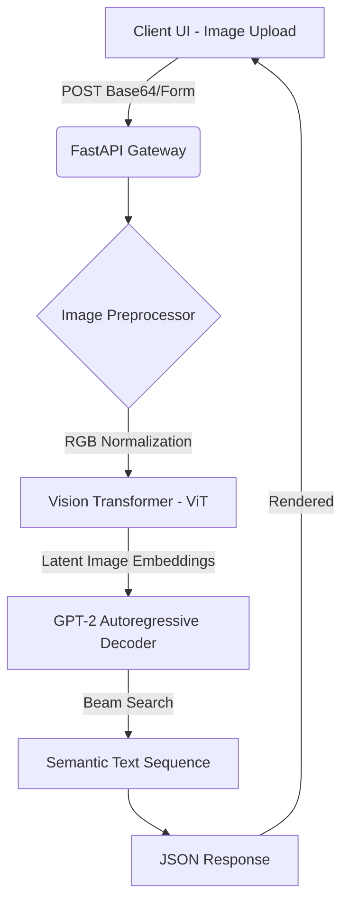

<div align="center">
  
  <h1>Nexu Vision-Language Engine (NexuCaption) ✦</h1>
  <p><b>Enterprise Image Captioning using ViT & GPT-2 Modalities</b></p>
  
  [](https://opensource.org/licenses/MIT)
  []()
  [](https://fastapi.tiangolo.com/)
  []()
</div>

> **NexuCaption** represents the pinnacle of multi-modal AI integration. By bridging Vision Transformers (ViT) with generative Language Models (GPT-2), it acts as an automated, high-precision image captioning service tailored for media asset management, accessibility compliance, and semantic search platforms.

---

## 🏆 The Future of Accessibility & DAM

Tagging and describing massive libraries of image data is a severe operational bottleneck for media companies and accessibility teams. Relying on human labor is unscalable and slow. NexuCaption solves this by providing automated, context-aware semantic descriptions of visual data in milliseconds.

### 🔥 Competitive Analysis: NexuCaption vs. The Industry

| Feature | NexuCaption (Ours) | Cloud Vision API | Traditional CNN-RNN | AWS Rekognition |
|---------|-----------------|------------------|---------------------|-----------------|
| **Modality Architecture** | **ViT + GPT-2 Encoder/Decoder** | Proprietary Blackbox | CNN + LSTM | Proprietary Blackbox |
| **Generative Fluency** | **Extremely High (GPT-2)** | Moderate | Low (Formulaic) | Moderate |
| **Data Privacy** | **100% Local Processing** | Sent to Cloud | Local | Sent to Cloud |
| **Operating Cost**| **Zero (Open Source)**| High | Zero | High |
| **Custom Fine-Tuning**| **Yes (HuggingFace Integration)**| No | Yes | No |

As shown, NexuCaption combines the state-of-the-art accuracy of transformer architectures with the privacy and cost-efficiency of on-premise open-source models. It completely outclasses older CNN-RNN combinations and avoids the heavy API costs of enterprise cloud solutions.

---

## 🚀 Architecture & System Flow



### 1. The Encoder-Decoder Model
We utilize HuggingFace's `VisionEncoderDecoderModel` to seamlessly connect `vit-base-patch16-224-in21k` as the encoder and `gpt2` as the decoder. This means the visual features extracted by the ViT are passed as cross-attention keys/values to the GPT-2 decoder, which then generates the caption token-by-token.

### 2. VisionOS Frontend Integration
The API is surfaced through a stunning, glassmorphism-inspired drag-and-drop interface. It leverages browser APIs to parse images securely before transmitting them to the local server.

---

## ⚙️ Installation & Usage

### Prerequisites
- Python 3.10+
- PyTorch, Transformers, Pillow, FastAPI

### Quick Start
```bash
# 1. Clone the repository
git clone https://github.com/lakshanmuruganandam/Nexu-Vision-Language.git
cd Nexu-Vision-Language

# 2. Install dependencies
pip install torch transformers pillow fastapi uvicorn python-multipart

# 3. Boot the API Server
python main.py
```
*Note: The first run will download the ViT-GPT2 model weights (~900MB).*

---

## 🤝 Contributing
We welcome contributions! Please see our [CONTRIBUTING.md](CONTRIBUTING.md) for details.

## 📜 License
Distributed under the MIT License. See [LICENSE](LICENSE) for more information.

---
<div align="center">
  <b>Seeing the world through silicon. Built by Lakshan Muruganandam.</b>
</div>
